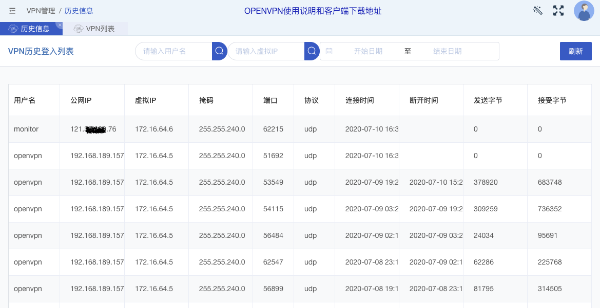

# openvpn-cms-vue

### （如果此系统对你有所帮助，请Start一波！！）

[后端系统传送门](https://github.com/xiaoyunjie/openvpn-cms-flask)

>基于Lin-cms-vue 二次开发的openvpn-cms-vue，是openvpn-cms的前端，后端是openvpn-cms-flask

VPN概览


VPN列表


VPN历史信息



### 安装部署
- Node.js（version：8.11.0+）
- npm (version: 5.6.0) 

克隆代码：`git clone https://github.com/xiaoyunjie/openvpn-cms-vue.git  openvpn-cms-vue`

安装npm：`yum install -y npm`

更新npm到5.6.0：`npm install -g npm`

切换node版本：`sudo n 8.11.3`

安装：`npm install`

更新node后，版本没有发生变化，原因是环境变量没有设置

```bash
echo "export N_PREFIX=/usr/local/bin" >> /etc/profile
echo "export PATH=\$N_PREFIX/bin:\$PATH" >> /etc/profile
source /etc/profile
```

#### 修改配置文件 index.js
```bash 
vi src/config/index.js
baseURL: 'http://IP:5000'   ## 地址改成本机IP，不要使用环回口或localhost
```

#### 启动
`npm install`

`npm run serve`

http://localhost:8000


### 发布
vue项目无需每次都 `npm run serve`，只需要打包成html页面，静态发布就行。

```bash
npm run build   ## 打包
```
打包完成后，会在当前目录下生成一个dist目录，里面就是静态文件，将文件放到指定目录下，并用nginx代理。

```bash
yum install nginx -y    ## 安装nginx
mkdir -p /www           ## 创建发布目录
cp -r dist/*  /www      ## 拷贝静态文件到发布目录
systemctl start nginx   ## 启动nginx
systemctl enable nginx  ## 开机启动nginx
```

nignx 配置
```bash
http {
    server {
        listen       80 default_server;
        server_name  _;
        root    /www;   
        
        location / {
        }
        error_page 404 /404.html;
            location = /40x.html {
        }
        error_page 500 502 503 504 /50x.html;
            location = /50x.html {
        }
    }
}
```


## 如果此系统对你有所帮助，请Start一波！！

## 欢迎交流
QQ：2913381648
